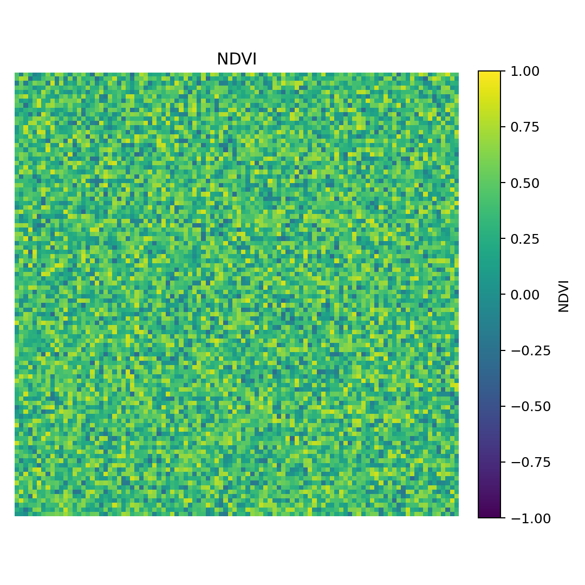

#  Wildfire Recovery Analyzer

A Python-based geospatial analysis tool for assessing post-wildfire vegetation recovery using NDVI (Normalized Difference Vegetation Index) from satellite imagery.

##  Overview
This project automates the process of loading satellite data, computing NDVI, and visualizing vegetation changes over time. It’s designed to support wildfire recovery analysis and environmental monitoring.

##  Features
- Load and preprocess raster (GeoTIFF) datasets  
- Calculate NDVI using Red/NIR bands  
- Visualize burn severity and vegetation regrowth  
- Automate analysis workflows with Python scripting  

##  Tech Stack
- **Python** (rasterio, numpy, matplotlib, geopandas)
- **Jupyter Notebook** for analysis
- **GDAL / rasterio** for geospatial raster processing

##  Project Structure
wildfire-recovery-analyzer/
~ data/ # imagery and results
~ src/ # main Python scripts
~ notebooks/ # Jupyter notebooks
~ requirements.txt
~ README.md

### Preview

